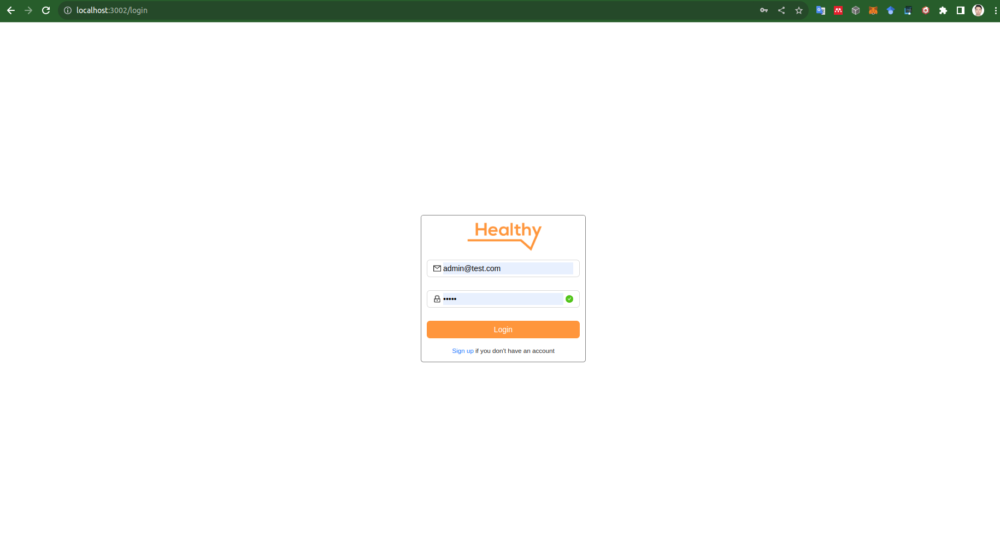

# Interview ArentVN

### Folder structure

```bash
├── be
│   ├── src
│   │   ├── controllers
│   │   ├── data
│   │   ├── routes
│   │   ├── services
│   │   ├── util
│   │   └── config.js
│   ├── index.js
│   └── package.json
├── fe
│   ├── config
│   ├── public
│   ├── src
│   │   ├── api
│   │   ├── components
│   │   ├── data
│   │   ├── functions
│   │   ├── img
│   │   ├── pages
│   │   ├── routes
│   │   ├── scss
│   │   ├── store
│   │   ├── App.js
│   │   └── index.js
│   └── package.json
└── README.md
```

### Usage:

In this codebase, I have implemented two methods:
1. Reactjs + Nodejs
1. Only React

### Login:
👍 User information for login:
```json
{
    "name":"admin@test.com", "password": "admin"
}
```
> #### Add user or edit password:
> If you using Method 1, you can edit a json file in be/src/data/user.json       
> If you using Method 2, you can edit a js file in fe/src/data/user.js

#### Method 1:
I created a Nodejs server to implement RESTful API

🚀 Run Backend (PORT 8002)::
```bash
cd be
npm install
npm start
```
🚀 Run Fontend (PORT 3002):
```bash
cd fe
npm install
npm run server
```
#### Method 2:

🚀 Run Fontend (PORT 3002):
```bash
cd fe
npm install
npm start
```

### User Interface:
1. Login page:

1. Main page:

1. Challenge page:

1. Column page: 

1. Menu:
